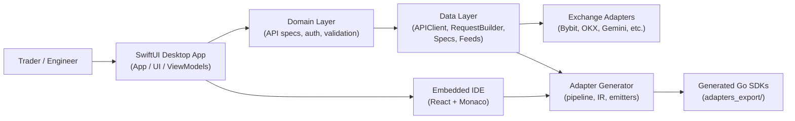

## CryptoForge – API Explorer & Adapter Generator for Crypto Exchanges

**CryptoForge** is a **desktop API explorer and code generator for crypto exchanges**, built as a production‑ready macOS app in SwiftUI.  
Think of it as **“Postman for makers + Go SDK generator”**: you can explore exchange REST APIs, send real requests, and export a strongly‑typed Go adapter that you can ship or sell.

> This document is written to showcase CryptoForge as a **monetizable, product‑grade developer tool**.

### MVP demonstration
Watch in my GoogleDrive(https://drive.google.com/file/d/1lxX1CcM74UWgTPlEe8LTHP5Saig6_rg-/view?usp=sharing)

### Why this product matters

- **Real problem**: every crypto exchange ships its own REST/WS API, auth scheme and error model.  
  Trading and market‑making teams repeatedly:
  - reverse‑engineer docs,
  - hand‑roll HTTP clients and signing logic,
  - debug subtle differences in rate limits and error formats.

- **CryptoForge solution**:
  - One macOS app where you can **explore and test endpoints** for multiple exchanges.
  - A **unified spec model** that normalizes exchange descriptions.
  - A **Go adapter generator** that emits production‑ready SDKs per exchange.

- **Target users**:
  - quant / trading teams,
  - market makers,
  - infrastructure engineers building connectivity to multiple venues.

### Monetization angles

- **Basic desktop app**
- **Pro desktop app**
- **Team / enterprise plans**
    
### Core capabilities

- **Unified API explorer**
  - Sidebar with exchanges (Kraken, Binance, Bybit, OKX, Gemini, Poloniex, …).
  - Method tree built from embedded JSON specs.
  - Request Builder with:
    - path & query params,
    - body editor with JSON pretty‑printing,
    - headers and auth configuration.
  - Response viewer with status, headers, formatted JSON and raw data.

- **Go adapter generator**
  - Takes a high‑level **adapter description** and emits a full Go package:
    - `client.go`, `request.go`, `signer.go`,
    - `mapper.go`, `dto.go`,
    - `errors.go`, `errors_map.go`,
    - `models.go`, `enums.go`, `interfaces.go`.
  - Generator pipeline:
    - builds an intermediate representation (IR),
    - validates contracts and error mappings,
    - uses emitters to produce idiomatic Go source files,
    - writes them to `adapters_export/<maker>/`.

- **Exchange‑aware auth & security**
  - API key in header/query, HMAC (Binance‑like) and other patterns.
  - Auth preflight that checks required keys/permissions before sending.
  - Secrets stored securely via macOS Keychain (`KeychainService`).

- **Developer‑focused UX**
  - Native macOS UI in SwiftUI (dark/light themes).
  - Embedded Monaco‑based editor (`ide-editor`) for previewing generated Go code.
  - News feed panel with parsed exchange announcements to track breaking changes.

### Architecture highlights

- **UI layer** (`App`, `UI`, `ViewModels`)
  - SwiftUI views for navigation, request building, generator UI, news.
  - View models that hold selection state, current request, and adapter configuration.

- **Domain layer** (`Domain`)
  - Models for API specs, endpoints, auth, responses, news items.
  - Validation engines for auth preflight and security rules.

- **Data & integrations** (`Data`, `Adapters`, `Security`)
  - `APIClient` + `RequestBuilder` on top of `URLSession`.
  - JSON specs for each exchange in `Resources/Specs/*.json`.
  - Per‑exchange adapters (`BybitAdapter`, `OKXAdapter`, `GeminiAdapter`, etc.) registered in a central registry.
  - `KeychainService` for secure storage of API keys.

- **Generator** (`AdapterGenerator`, `adapters_export`)
  - Pipeline that converts `AdapterDescription` into IR.
  - Emitters that generate Go code for models, DTOs, client, signer, mapper, errors.
  - File system writer that outputs ready‑to‑use Go modules.

### High-level architecture diagram

### Tech stack

- **Platform**: macOS 13+, Xcode 15+, Swift 5.9+
- **UI**: SwiftUI desktop app
- **Data / storage**: SwiftData, Keychain
- **Networking**: URLSession, custom request builder
- **Codegen**: Swift‑based Go generator (no templates engine dependency)
- **Embedded IDE**: Vite + React + TypeScript + Monaco

### Typical workflow

1. Launch the CryptoForge macOS app.
2. Choose an exchange from the list (**“Add Maker”**).
3. Pick an endpoint from the sidebar and build a request in the Request Builder (full request is pre-defined, fill the required fields).
4. Send the request and inspect the response.
5. Switch to the Adapter Generator, select the same maker and generate a Go adapter.
6. Open the generated package in the embedded IDE, or consume it from `adapters_export/<maker>/` in your own services.

### How this project demonstrates product thinking

- Solves a **real, painful developer problem** in the crypto ecosystem.
- Has a clear **positioning and value proposition** for a paying audience.
- Designed with **architecture and extensibility** in mind (new exchanges, new languages, new auth schemes).
- Provides an obvious path to **pricing, packaging and enterprise upsell**.

